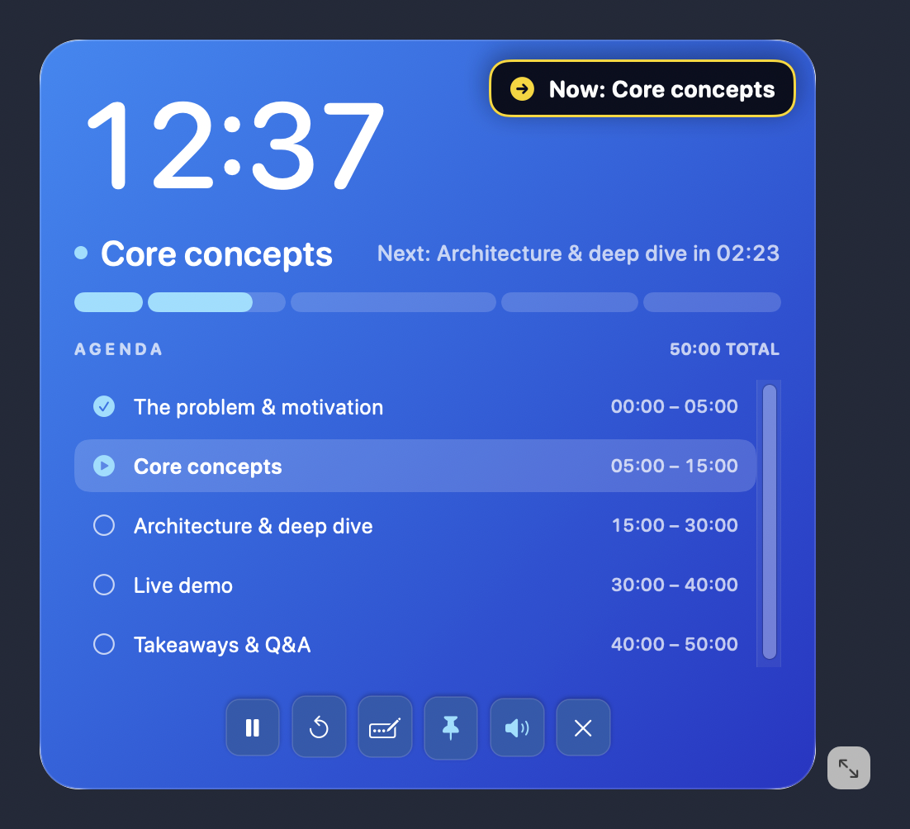

# Speaker Timer

Speaker Timer is a native macOS presentation timer that keeps your full agenda visible above full-screen slides. It counts up from zero, highlights the current section, shows upcoming checkpoints, and continues into overtime so you always know where the talk stands.



Your entire talk at a glance: elapsed time, progress, every section's time range, and controls that stay within reach.

## Highlights

- Always-on-top timer that remains visible over full-screen Keynote, PowerPoint, Google Slides, and Zoom.
- Proportional segmented progress bar with current and next-section guidance.
- Named presentation plans with editable, reorderable sections.
- Visual and optional sound alert at each checkpoint.
- Four high-contrast timer themes: Frosted Dark, Black, Cream, and Blue.
- Non-activating floating display with always-visible controls.
- Complete agenda with time ranges, completed sections, and a highlighted current section.
- Click any agenda section to jump to its start while keeping the timer running or paused.
- Accurate pause, resume, wake, and overtime behavior based on a monotonic clock.
- No account, analytics, network access, or third-party dependencies.

Speaker Timer requires macOS 14 Sonoma or later and supports Apple Silicon and Intel Macs.

## Install with Homebrew

```sh
brew install --cask laixintao/tap/speaker-timer
```

You can also download `Speaker-Timer-<version>-macos-universal.dmg` from [GitHub Releases](https://github.com/laixintao/speaker-timer/releases), open it, and drag Speaker Timer into Applications. Version 1.0.0 uses the earlier filename `Speaker-Timer-1.0.0-universal.dmg`.

Releases are ad-hoc signed and are not notarized with an Apple Developer ID. If macOS blocks the first launch, follow Apple's instructions and use **System Settings → Privacy & Security → Open Anyway** for an app you trust.

## Use

1. Create or select a presentation plan.
2. Add sections and enter durations as minutes (`5`), minutes and seconds (`5:30`), or hours, minutes, and seconds (`1:05:00`).
3. Press **Start**. Drag an empty area of the floating timer to move it to the presenter display, and use the corner handle to resize it.
4. Press Space while Speaker Timer is active to pause or resume. Press ⌘R to reset.
5. Click a section in the floating agenda to jump forward or backward to its planned start time. A running timer keeps running; a paused timer stays paused. Before starting, clicking a section cues it in the paused state.

The floating timer does not take keyboard focus from the slide application. Its controls stay visible, and you can scroll the agenda when it is longer than the window. With an extended desktop, a timer placed on the MacBook display is not shown on the external presentation display.

## Build from source

Only the macOS Command Line Tools are required; a full Xcode installation is optional.

```sh
make build
make test
make package
```

`make package` creates a universal app, DMG, ZIP, and `SHA256SUMS` in `dist/`. Run the full local verification with `make ci`.

## Release

After committing changes on a clean `main` branch:

```sh
make release
make release VERSION=1.1.0  # optional explicit version
```

The first invocation publishes the current app version. Later invocations bump the patch version by default. The command validates repository state, commits release metadata when necessary, creates an annotated tag, and atomically pushes `main` and the tag. GitHub Actions then tests both architectures, publishes verified installers, and creates build provenance attestations. See [the release guide](docs/RELEASING.md) for details.

## License

[MIT](LICENSE)
